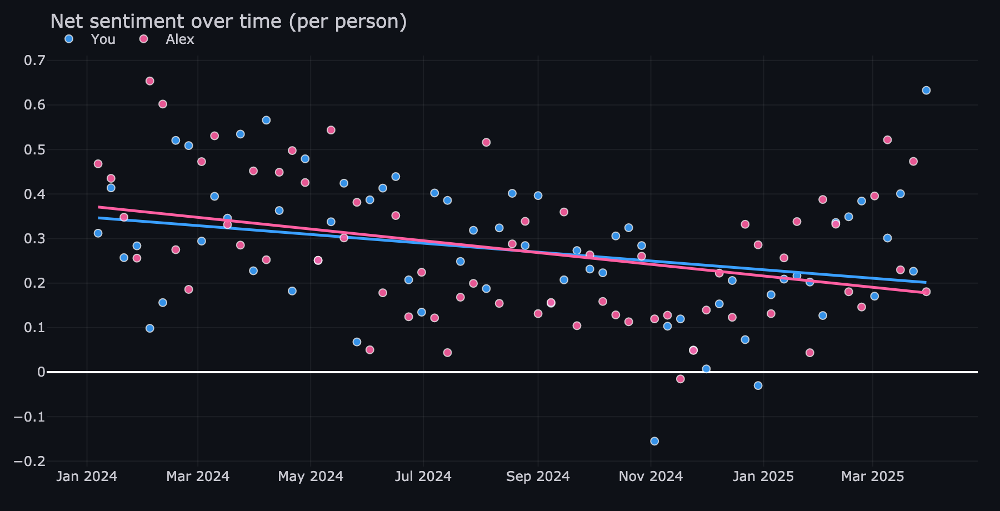
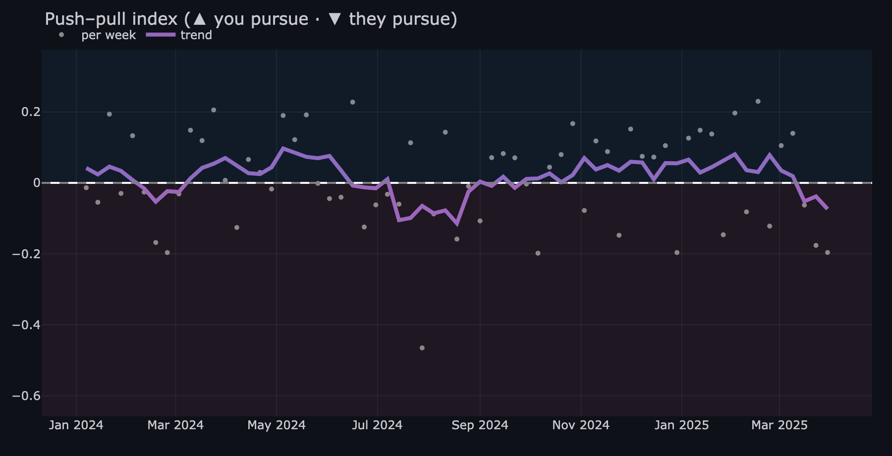
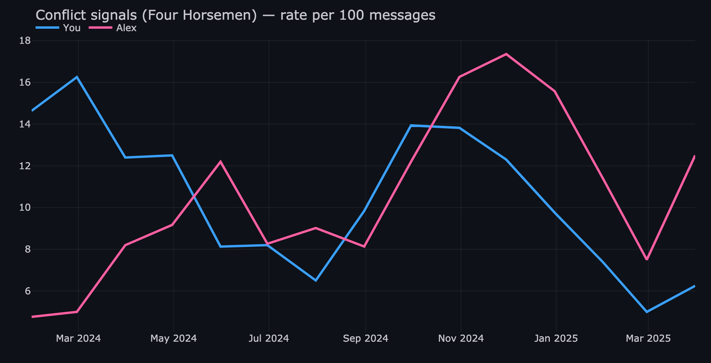
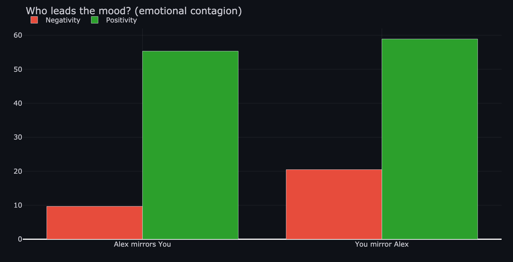
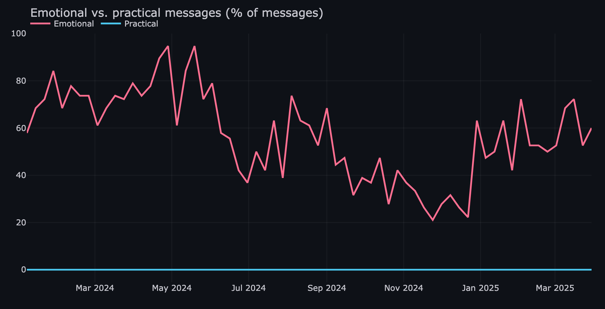

<div align="center">

# 💬 iMessage Relationship Analytics

### *Your texts — and the subtext beneath them.*

**A private, on-device dashboard that turns your iMessage history into a
relationship-science readout: sentiment, conflict patterns, pursue–withdraw
dynamics, emotional contagion, trust signals, and more — over time.**

`100% local` · `no cloud` · `no accounts` · `nothing leaves your Mac`

</div>

---

> 🔒 **Privacy first, by design.** `subtext` reads the local macOS Messages
> database in read-only mode and runs entirely on your machine. No data is ever
> uploaded. Your messages, the cache, and your personal contact aliases are all
> git-ignored and never leave your computer.

All images below are from **synthetic sample data** (`generate_samples.py`) — no real messages.

|  |  |
|:--:|:--:|
| **Sentiment over time, per person** | **Pursue–withdraw dynamics** |
|  |  |
| **Conflict signals (Gottman Four Horsemen)** | **Who leads the mood? (emotional contagion)** |
|  |  |
| **Emotional vs. practical messages** | |
|  | |

## ✨ What you can explore

- **💚 Emotional tone** — sentiment, % positive/negative, and your most positive & most negative messages
- **📊 Activity & cadence** — volume, reply latency, who initiates, reciprocity, late-night share
- **🤝 Connection & affection** — affection, encouragement/compliments, emoji, questions, vulnerability
- **🧲 Pursue–withdraw** — a signed index of who reaches out while the other pulls back *(Christensen & Heavey, 1990)*
- **🔬 Gottman Four Horsemen** — criticism, contempt, defensiveness, stonewalling + repair attempts & the 5:1 positivity ratio *(Gottman & Levenson, 1992)*
- **🧭 Who leads** — emotional contagion & lead–lag: whose mood the other mirrors
- **🛡️ Trust signals** — commitments, accountability, affirmation, and distrust language
- **🧠 Personality** — an MBTI-style type indicator from writing style, calibrated against your own conversations
- **🏆 All relationships** — compare everyone you text, and an optional **family** view

Click any dot on a chart to read the actual messages behind it.

> ⚠️ **These are text-based proxies for reflection, not clinical diagnoses.**
> Sentiment uses [VADER](https://github.com/cjhutto/vaderSentiment); behavioral
> metrics use transparent, documented heuristics. They surface *patterns worth
> thinking about* — they cannot measure anyone's true character or feelings.

## 🚀 Quick start (macOS)

```bash
# 1. Grant Full Disk Access to your terminal / VS Code:
#    System Settings → Privacy & Security → Full Disk Access → enable →
#    fully quit (Cmd+Q) and reopen.  (Needed to read ~/Library/Messages/chat.db)

# 2. Install dependencies
pip install -r requirements.txt

# 3. Build the local cache (prints a coverage report)
python3 extract.py

# 4. Launch the dashboard  →  http://localhost:8501
streamlit run app.py
```

**Just want to see what it looks like?** Run the demo on synthetic data — no Full Disk Access needed:

```bash
MSGANALYTICS_DEMO=1 streamlit run app.py
```

**Export a single conversation to Markdown:**

```bash
python3 export_chat.py --who someone@example.com --out conversation.md
```

## ⚙️ Personalize (optional)

Copy the template and edit to add real names, merge a person's multiple
numbers/emails, exclude noise (spam, businesses, toll-free), and tag your kids:

```bash
cp aliases.example.json aliases.json   # aliases.json is git-ignored
```

## 🧩 How it's built

| File | Role |
|------|------|
| `messages_lib.py` | Read-only access to `chat.db` (snapshot, timestamps, `attributedBody` decode) |
| `contacts.py` | Resolve phone/email → names & photos from the macOS Contacts DB |
| `aliases.py` | Merge a person's identifiers, exclude noise, set names (config in `aliases.json`) |
| `extract.py` | Load all messages into a tidy cached table |
| `signals.py` | Per-person signals over time |
| `dynamics.py` | Pursue–withdraw + who-leads contagion |
| `gottman.py` | Four Horsemen, repair, positivity ratio |
| `trust.py` | Trust-related language signals |
| `personality.py` | Population-calibrated MBTI-style type indicator |
| `overview.py` | Cross-relationship comparison |
| `app.py` | Streamlit dashboard |

## 🔐 Notes on data & completeness

The macOS `chat.db` reflects what's synced to *this* Mac. `extract.py` prints a
coverage report so you can see your date range and iMessage/SMS split. Nothing is
uploaded — this is a personal, on-device tool.

## 📄 License

[MIT](LICENSE) — free to use, modify, and build on.

<div align="center">
<sub>Built with Python · pandas · Plotly · Streamlit · VADER</sub>
</div>
